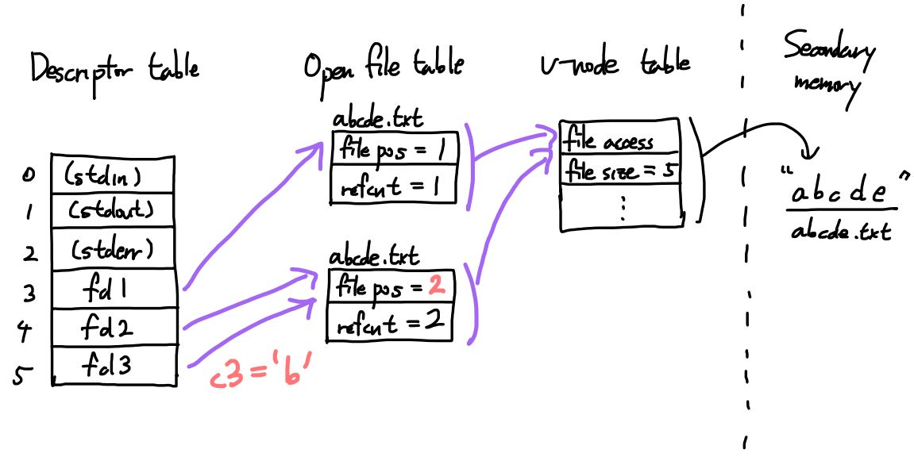
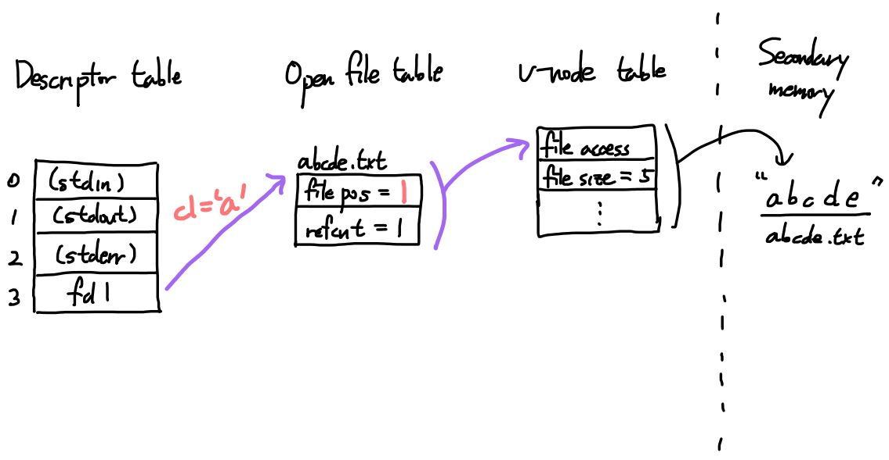

# System-Level I/O Homework


공과대학 컴퓨터공학부
2020-14378
윤교준 / Gyojun Youn
youngyojun@snu.ac.kr


## Fun with File Descriptors Problems

### Problem 1.

`abcde`가 적혀있는 파일 `abcde.txt`를 `argv[1]`로 전달했다고 하자.

`ffiles1.c`에서 다음까지의 코드를 수행하면, descriptor table과 open file table, v-node table의 상태는 다음과 같이 된다.

```c
fd1 = Open("abcde.txt", O_RDONLY, 0);
fd2 = Open("abcde.txt", O_RDONLY, 0);
fd3 = Open("abcde.txt", O_RDONLY, 0);
```


`Dup2(fd2, fd3);`을 수행하면 `fd3`의 파일은 close되고, `fd2`와 같은 entry를 공유하게 된다.


이제, `fd1`과 `fd2`로 한 글자씩 읽게 되면, `c1`과 `c2`의 값은 둘 다 `a`가 된다. 이 두 file descriptor는 서로 다른 open file table의 entries를 참조하며, file position 정보는 바로 이 entry에서 관리하기 때문이다.

```c
Read(fd1, &c1, 1); // c1 == 'a'
Read(fd2, &c2, 1); // c2 == 'a'
```


이제, `fd3`으로 한 글자를 읽자. `fd3`가 가리키는 file entry의 file position의 값은 1이다. 따라서, index 1의 한 바이트를 읽게 된다.

```c
Read(fd3, &c3, 1); // c3 = 'b'
```




따라서, `ffiles1.c`의 수행 결과는 `c1 = a, c2 = a, c3 = b`일 것이다. 실제로, 실습용 서버에서 실행해도 같은 결과를 얻는다.

```
stu70@sp01:~/hw-io$ gcc -o ffiles1 ffiles1.c csapp.c -lpthread
stu70@sp01:~/hw-io$ cat abcde.txt 
abcde
stu70@sp01:~/hw-io$ ./ffiles1 abcde.txt 
c1 = a, c2 = a, c3 = b
```


### Problem 2

Problem 1과 마찬가지로, 내용 `abcde`가 담겨있는 파일 `abcde.txt`를 `argv[1]`로 전달했다고 생각하자.

```c
fd1 = Open("abcde.txt", O_RDONLY, 0);
```


`fd1`에서 한 바이트를 읽으면, `a`를 얻는다.

```c
Read(fd1, &c1, 1); // c1 == 'a'
```




이제 `fork()`를 수행하자. Child process의 descriptor table은 Parent process의 것의 clone을 가진다. 스택 변수 `c1`도 복제된 것을 가지기에, 그 값은 `a`라야 한다.


이제, 케이스 분석을 하자. Parent process의 pid가 짝수라면, parent가 먼저 `fd1`로부터 한 바이트를 읽어들인다. 즉, parent의 `c2`는 `b`가 되며, 이때, open file table의 해당 entry의 file position은 2로 증가한다. 따라서, 시간적으로 늦게 읽는 child process는 `c`를 읽어들여 `c2`에 저장한다. 즉, 이 경우 출력 결과는 다음과 같다.

```
Parent: c1 = a, c2 = b
Child: c1 = a, c2 = c
```

반대로, Parent process의 pid가 홀수라면, child process가 먼저 한 바이트 `b`를 읽어들이고, 이후, parent process가 `c`를 읽는다.

```
Child: c1 = a, c2 = b
Parent: c1 = a, c2 = c
```


실습용 서버에서 실행해도 같은 결과를 확인할 수 있다. Parent process pid가 홀수인 결과는 다음과 같다.

```
stu70@sp01:~/hw-io$ gcc -o ffiles2 ffiles2.c csapp.c -lpthread
stu70@sp01:~/hw-io$ ./ffiles2 abcde.txt 
Child: c1 = a, c2 = b
Parent: c1 = a, c2 = c
```

짝수일 때는 조금 재미있는 현상을 볼 수 있다. Parent process가 먼저 죽어버려서, child가 zombie화 된 후에 출력을 뱉지만, terminal은 이를 감지하지 못한다. 따라서, 출력이 깨져서 보인다.

```
stu70@sp01:~/hw-io$ ./ffiles2 abcde.txt 
Parent: c1 = a, c2 = b
stu70@sp01:~/hw-io$ Child: c1 = a, c2 = c
```

표준출력을 redirect하면, 깔끔한 결과를 얻을 수 있다.

```
stu70@sp01:~/hw-io$ ./ffiles2 abcde.txt > result.txt
stu70@sp01:~/hw-io$ cat result.txt
Parent: c1 = a, c2 = b
Child: c1 = a, c2 = c
```


### Problem 3

`argv[1]`에 빈 파일 `result.txt`를 전달하자. Secondary memory를 간략화하여 track하자.

```c
fd1 = Open("result.txt", O_CREAT|O_TRUNC|O_RDWR, S_IRUSR|S_IWUSR);
Write(fd1, "pqrs", 4);
```


이제, append 옵션으로 파일을 열자. append 옵션은 쓰기 연산이 이루어질 때마다, file position이 항상 파일의 끝을 나타내도록 한다. 이는 `lseek` 함수 등으로 file position을 강제해도 이것이 무효화되는 효과를 얻는다.

```c
fd3 = Open("result.txt", O_APPEND|O_WRONLY, 0);
```


따라서, `fd3`로 `jklmn`의 다섯 바이트를 쓰면, 이는 파일의 끝에 적히게 된다. 그러나, `fd1`의 entry의 file position은 그대로 4다.

```c
Write(fd3, "jklmn", 5);
```


```c
fd2 = dup(fd1); /* Allocates descriptor */
```


`fd2`로 네 바이트를 적으면, file position 값이 4이므로, index 4 위치부터 overwrite하여 쓰기를 수행한다.

```c
Write(fd2, "wxyz", 4);
```


마지막으로, `fd3`로 두 바이트를 적으면, append 옵션에 의해, 파일 끝에 추가적으로 적게 된다.

```c
Write(fd3, "ef", 2);
```


따라서, 파일 `result.txt`에는 내용 `pqrswxyznef`가 담겨있을 것이다. 이는 초기에 파일이 내용을 담고 있거나, 심지어 파일이 존재하지 않았어도 동일하다. 왜냐하면, 처음에 파일을 열 때, 두 개의 옵션 create와 truncate를 주었기 때문이다.


실습용 서버에서 수행한 결과는 아래와 같다. 파일 끝에 개행 문자가 없어, 마지막에 줄바꿈이 이루어지지 않는다.

```
stu70@sp01:~/hw-io$ gcc -o ffiles3 ffiles3.c csapp.c -lpthread
stu70@sp01:~/hw-io$ ./ffiles3 result.txt
stu70@sp01:~/hw-io$ cat result.txt 
pqrswxyznef
```


## Standard I/O Buffering in Action

`strace` 명령어를 사용하면 프로세스가 수행하는 system calls와 signals의 정보를 track할 수 있다.

```
stu70@sp01:~/hw-io$ gcc -o hello hello.c
stu70@sp01:~/hw-io$ ./hello
hello
stu70@sp01:~/hw-io$ strace ./hello 
execve("./hello", ["./hello"], 0x7ffc3e13a770 /* 31 vars */) = 0
brk(NULL)                               = 0x5607e3f3b000
arch_prctl(0x3001 /* ARCH_??? */, 0x7ffea52cf0c0) = -1 EINVAL (Invalid argument)
access("/etc/ld.so.preload", R_OK)      = -1 ENOENT (No such file or directory)
openat(AT_FDCWD, "/etc/ld.so.cache", O_RDONLY|O_CLOEXEC) = 3
fstat(3, {st_mode=S_IFREG|0644, st_size=30080, ...}) = 0
mmap(NULL, 30080, PROT_READ, MAP_PRIVATE, 3, 0) = 0x7f5a21d27000
close(3)                                = 0
openat(AT_FDCWD, "/lib/x86_64-linux-gnu/libc.so.6", O_RDONLY|O_CLOEXEC) = 3
read(3, "\177ELF\2\1\1\3\0\0\0\0\0\0\0\0\3\0>\0\1\0\0\0\300A\2\0\0\0\0\0"..., 832) = 832
pread64(3, "\6\0\0\0\4\0\0\0@\0\0\0\0\0\0\0@\0\0\0\0\0\0\0@\0\0\0\0\0\0\0"..., 784, 64) = 784
pread64(3, "\4\0\0\0\20\0\0\0\5\0\0\0GNU\0\2\0\0\300\4\0\0\0\3\0\0\0\0\0\0\0", 32, 848) = 32
pread64(3, "\4\0\0\0\24\0\0\0\3\0\0\0GNU\0\30x\346\264ur\f|Q\226\236i\253-'o"..., 68, 880) = 68
fstat(3, {st_mode=S_IFREG|0755, st_size=2029592, ...}) = 0
mmap(NULL, 8192, PROT_READ|PROT_WRITE, MAP_PRIVATE|MAP_ANONYMOUS, -1, 0) = 0x7f5a21d25000
pread64(3, "\6\0\0\0\4\0\0\0@\0\0\0\0\0\0\0@\0\0\0\0\0\0\0@\0\0\0\0\0\0\0"..., 784, 64) = 784
pread64(3, "\4\0\0\0\20\0\0\0\5\0\0\0GNU\0\2\0\0\300\4\0\0\0\3\0\0\0\0\0\0\0", 32, 848) = 32
pread64(3, "\4\0\0\0\24\0\0\0\3\0\0\0GNU\0\30x\346\264ur\f|Q\226\236i\253-'o"..., 68, 880) = 68
mmap(NULL, 2037344, PROT_READ, MAP_PRIVATE|MAP_DENYWRITE, 3, 0) = 0x7f5a21b33000
mmap(0x7f5a21b55000, 1540096, PROT_READ|PROT_EXEC, MAP_PRIVATE|MAP_FIXED|MAP_DENYWRITE, 3, 0x22000) = 0x7f5a21b55000
mmap(0x7f5a21ccd000, 319488, PROT_READ, MAP_PRIVATE|MAP_FIXED|MAP_DENYWRITE, 3, 0x19a000) = 0x7f5a21ccd000
mmap(0x7f5a21d1b000, 24576, PROT_READ|PROT_WRITE, MAP_PRIVATE|MAP_FIXED|MAP_DENYWRITE, 3, 0x1e7000) = 0x7f5a21d1b000
mmap(0x7f5a21d21000, 13920, PROT_READ|PROT_WRITE, MAP_PRIVATE|MAP_FIXED|MAP_ANONYMOUS, -1, 0) = 0x7f5a21d21000
close(3)                                = 0
arch_prctl(ARCH_SET_FS, 0x7f5a21d26540) = 0
mprotect(0x7f5a21d1b000, 16384, PROT_READ) = 0
mprotect(0x5607e239c000, 4096, PROT_READ) = 0
mprotect(0x7f5a21d5c000, 4096, PROT_READ) = 0
munmap(0x7f5a21d27000, 30080)           = 0
fstat(1, {st_mode=S_IFCHR|0620, st_rdev=makedev(0x88, 0x8), ...}) = 0
brk(NULL)                               = 0x5607e3f3b000
brk(0x5607e3f5c000)                     = 0x5607e3f5c000
write(1, "hello\n", 6hello
)                  = 6
exit_group(0)                           = ?
+++ exited with 0 +++
```


몇 개의 내용만 모아보자. `strace`에 의해 `evecve`로 실행파일 `./hello`를 현재 프로세스에 탑재하여 실행한다.

```
execve("./hello", ["./hello"], 0x7ffc3e13a770 /* 31 vars */) = 0
```

이 부분은 표준출력과 섞여서 조금 깨졌다. 총 여섯 번의 `printf` 함수 호출이 있었지만, buffer에 기록될 뿐 즉각적으로 출력되지 않았고, `fflush(stdout);`을 수행하자 buffer를 한 번에 비움을 확인할 수 있다.

```
write(1, "hello\n", 6) = 6
```
