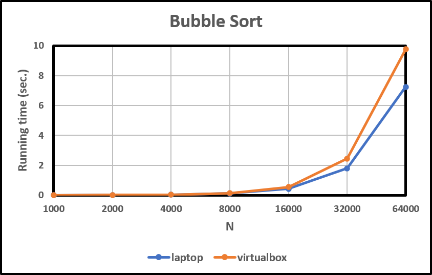
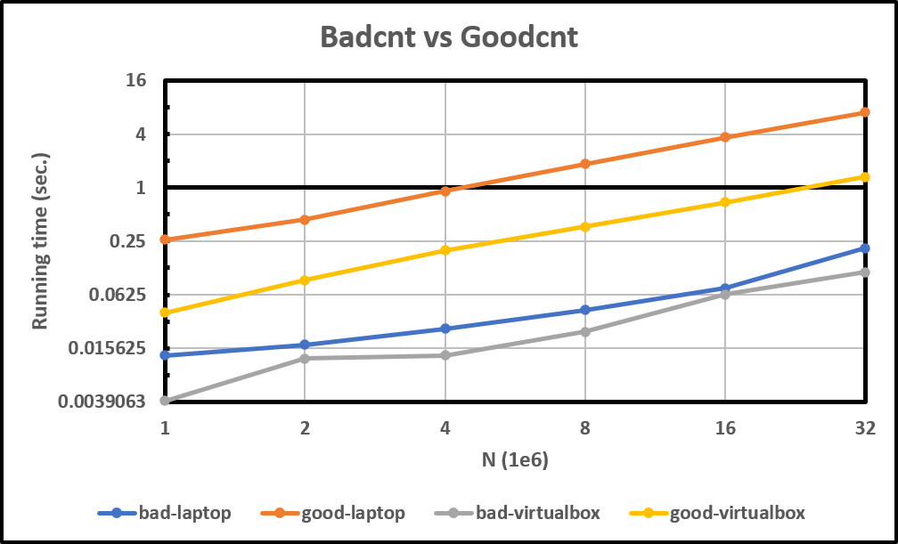
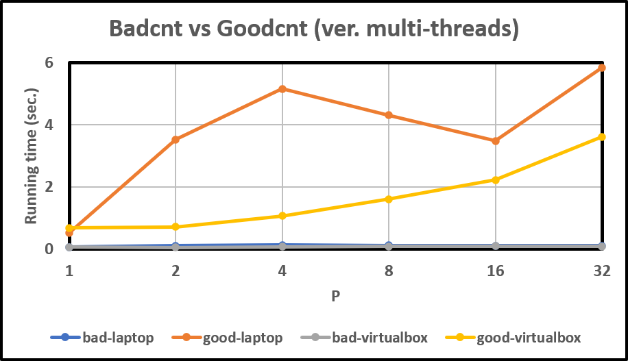
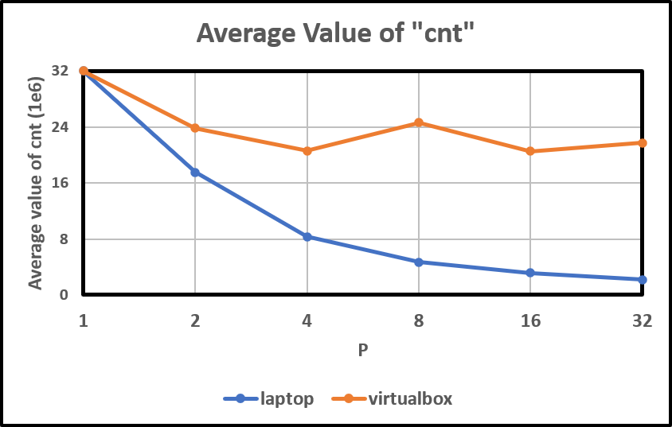

# Semaphores Homework


공과대학 컴퓨터공학부
2020-14378
윤교준 / Gyojun Youn
youngyojun@snu.ac.kr


## 실험 환경

총 두 개의 환경에서 프로그램을 실행하였다.

* `youngyojun-virtualbox` : 단일 프로세스 (Windows 10, Virtual box; Ubuntu 20.04 LTS)

  * ```
    youngyojun@youngyojun-virtualbox:~/HWs/sp-hw-semaphores$ uname -ar
    Linux youngyojun-virtualbox 5.15.0-71-generic #78~20.04.1-Ubuntu SMP Wed Apr 19 11:26:48 UTC 2023 x86_64 x86_64 x86_64 GNU/Linux
    youngyojun@youngyojun-virtualbox:~/HWs/sp-hw-semaphores$ grep -c processor /proc/cpuinfo 
    1
    ```

* `youngyojun-laptop` : 8개의 프로세스 (Ubuntu 20.04 LTS)

  * ```
    (base) youngyojun@youngyojun-laptop:~/SP/sp-hw-semaphores$ uname -ar
    Linux youngyojun-laptop 5.15.0-72-generic #79~20.04.1-Ubuntu SMP Thu Apr 20 22:12:07 UTC 2023 x86_64 x86_64 x86_64 GNU/Linux
    (base) youngyojun@youngyojun-laptop:~/SP/sp-hw-semaphores$ grep -c processor /proc/cpuinfo 
    8
    ```


## 수행 속도의 비교

### Bubble sort

먼저, 기준이 되는 benchmark 프로그램이 필요하다. $N$ 개의 random integers를 생성한 후, 일반적인 $O\left( \frac{1}{2} N \right)$ 시간 복잡도의 bubble sort로 배열을 정렬하는 `bubblesort.c` 코드를 작성하였다.

```c
#include <stdio.h>
#include <stdlib.h>

/* linear congruent */
int f()
{
  static const int a = 1103515245, c = 12345;
  static int x = 20010610;

  return x = a*x + c;
}

int main(int argc, char **argv)
{
  int n = atoi(argv[1]);
  int i, j, t;

  int *arr = malloc(n * sizeof(int));

  if (!arr) {
    printf("malloc error\n");
    exit(-1);
  }

  for (i = 0; i < n; i++)
    arr[i] = f();

  for (i = 0; i < n; i++)
    for (j = i+1; j < n; j++)
      if (arr[j-1] > arr[j]) {
        t = arr[j-1];
        arr[j-1] = arr[j];
        arr[j] = t;
      }

  free(arr);
  arr = NULL;

  exit(0);
}
```


이 코드를 포함하여 모든 코드의 실행 시간은 다음과 같이 `time`  명령어로 측정하였다.

```
(base) youngyojun@youngyojun-laptop:~/SP/sp-hw-semaphores$ gcc -o bubblesort bubblesort.c
(base) youngyojun@youngyojun-laptop:~/SP/sp-hw-semaphores$ time ./bubblesort 1000

real	0m0.007s
user	0m0.007s
sys	0m0.000s
(base) youngyojun@youngyojun-laptop:~/SP/sp-hw-semaphores$ time ./bubblesort 2000

real	0m0.013s
user	0m0.009s
sys	0m0.004s
```


$N \in \{ 1\,000, 2\,000, 4\,000, 8\,000, 16\,000, 32\,000, 64\,000 \}$에 대해서 측정하였다. 10억 개 즈음의 가벼운 instructions을 수행하면 1초 정도 걸린다고 어림 잡을 수 있다. `laptop`은  `virtualbox`보다 대략 1.4배 정도 빠르다. $N$-축은 $\lg$-scaling 되어 있음에 유의하라.




### Badcnt vs Goodcnt

강의 자료에 있는 `badcnt.c` 코드는 아래와 같다.

```c
#include <stdio.h>
#include <stdlib.h>
#include "csapp.h"

volatile int cnt = 0; /* global */

void *thread(void *vargp)
{
  int i, niters = *((int *)vargp);

  for (i = 0; i < niters; i++)
    cnt++;

  return NULL;
}

int main(int argc, char **argv)
{
  int niters = atoi(argv[1]);
  pthread_t tid1, tid2;

  Pthread_create(&tid1, NULL, thread, &niters);
  Pthread_create(&tid2, NULL, thread, &niters);

  Pthread_join(tid1, NULL);
  Pthread_join(tid2, NULL);

  /* Check result */
  if (cnt != (2 * niters))
    printf("BOOM! cnt=%d\n", cnt);
  else
    printf("OK cnt=%d\n", cnt);
  exit(0);
}
```


`badcnt.c`에서 semaphore를 적용하여 올바르게 작동하도록 수정한 `goodcnt.c` 코드는 이러하다.

```c
#include <stdio.h>
#include <stdlib.h>
#include "csapp.h"

volatile int cnt = 0; /* global */

void *thread(void *vargp)
{
  int i, niters = *((int *)vargp);

  for (i = 0; i < niters; i++)
    cnt++;

  return NULL;
}

int main(int argc, char **argv)
{
  int niters = atoi(argv[1]);
  pthread_t tid1, tid2;

  Pthread_create(&tid1, NULL, thread, &niters);
  Pthread_create(&tid2, NULL, thread, &niters);

  Pthread_join(tid1, NULL);
  Pthread_join(tid2, NULL);

  /* Check result */
  if (cnt != (2 * niters))
    printf("BOOM! cnt=%d\n", cnt);
  else
    printf("OK cnt=%d\n", cnt);
  exit(0);
}
```


이 두 코드를 어떠한 최적화 옵션도 주지 않고 컴파일하여, $N / 10^6 \in \{ 1, 2, 4, 8, 16, 32 \}$에 대하여 실행 시간을 측정하였다.

```
(base) youngyojun@youngyojun-laptop:~/SP/sp-hw-semaphores$ gcc -o badcnt badcnt.c csapp.c -pthread
(base) youngyojun@youngyojun-laptop:~/SP/sp-hw-semaphores$ gcc -o goodcnt goodcnt.c csapp.c -pthread
```




위의 그래프에서 $N$-축과 실행시간-축은 모두 $\lg$-scaling 되어 있다. 두 코드 모두 실행 환경에 관계없이 $N$에 비례하는 선형의 실행 시간을 가진다. `badcnt`의 수행 속도는 `goodcnt`에 비하여 상당히 빨랐다. `goodcnt`는 `badcnt`보다 4배에서 16배 가량 느리다. 특히, 단일 프로세스의 `virtualbox` 환경이 8개 프로세스의 `laptop` 환경보다 4배 가량 빠른 점이 인상적이다. `cnt` 변수에 대한 race condition이 프로세스가 많을 수록 더 잦게 발생하기 때문일 것이다.


### Badcnt vs Goodcnt (ver. multi-threads)

Thread의 수에 따라 수행 속도가 달라지는지 확인하기 위하여, 기존의 코드를 약간 수정하여 `multi-badcnt.c`와 `multi-goodcnt.c`를 작성하였다.

```c
/* multi-badcnt.c */
#include <stdio.h>
#include <stdlib.h>
#include "csapp.h"

volatile int cnt = 0; /* global */

void *thread(void *vargp)
{
  int i, niters = *((int *)vargp);

  for (i = 0; i < niters; i++)
    cnt++;

  return NULL;
}

int main(int argc, char **argv)
{
  int nthreads = atoi(argv[1]);
  int niters = atoi(argv[2]);
  int i;

  pthread_t *tids = malloc(nthreads * sizeof(pthread_t));
  if (!tids) {
    printf("malloc failed\n");
    exit(-1);
  }

  for (i = 0; i < nthreads; i++)
    Pthread_create(&tids[i], NULL, thread, &niters);

  for (i = 0; i < nthreads; i++)
    Pthread_join(tids[i], NULL);
	
  free(tids);
  tids = NULL;

  /* Check result */
  if (cnt != (nthreads * niters))
    printf("BOOM! cnt=%d\n", cnt);
  else
    printf("OK cnt=%d\n", cnt);

  exit(0);
}
```


```c
/* multi-goodcnt.c */
#include <stdio.h>
#include <stdlib.h>
#include "csapp.h"

volatile int cnt = 0; /* global */
sem_t mutex;          /* semaphore that protects cnt */

void *thread(void *vargp)
{
  int i, niters = *((int *)vargp);

  for (i = 0; i < niters; i++) {
    P(&mutex);
    cnt++;
    V(&mutex);
  }
	
  return NULL;
}

int main(int argc, char **argv)
{
  int nthreads = atoi(argv[1]);
  int niters = atoi(argv[2]);
  int i;
  
  Sem_init(&mutex, 0, 1);

  pthread_t *tids = malloc(nthreads * sizeof(pthread_t));
  if (!tids) {
    printf("malloc failed\n");
    exit(-1);
  }

  for (i = 0; i < nthreads; i++)
    Pthread_create(&tids[i], NULL, thread, &niters);

  for (i = 0; i < nthreads; i++)
    Pthread_join(tids[i], NULL);
	
  free(tids);
  tids = NULL;

  /* Check result */
  if (cnt != (nthreads * niters))
    printf("BOOM! cnt=%d\n", cnt);
  else
    printf("OK cnt=%d\n", cnt);

  exit(0);
}
```


$N \times P = 32 \times 10^6$으로 고정하고, threads의 개수를 $P \in \{ 1, 2, 4, 8, 16, 32 \}$로 변화시켜 실행 시간을 측정하였다.

```
(base) youngyojun@youngyojun-laptop:~/SP/sp-hw-semaphores$ gcc -o multi-badcnt multi-badcnt.c csapp.c -pthread
(base) youngyojun@youngyojun-laptop:~/SP/sp-hw-semaphores$ gcc -o multi-goodcnt multi-goodcnt.c csapp.c -pthread
```





$P = 1$의 경우에는 semaphore로 인한 성능 저하를 확인해볼 수 있다. `multi-badcnt`는 약 0.06초만큼 걸린 반면, `multi-goodcnt`는 0.5초 이상 걸렸다. 즉, semaphore는 8배 이상의 성능 저하를 야기한다고 말할 수 있다.

단일 프로세스의 `virtualbox`에서는 $P$에 따라 실행 시간이 증가하는 양상을 보인 반면, 8개 프로세스의 `laptop`에서는 실행 시간과 $P$의 유의미한 연관 관계를 찾기 어려웠다.


## Badcnt에서 cnt의 값

`multi-badcnt`에서 $N \times P = 32 \times 10^6$으로 고정해놓고, $P \in \{ 1, 2, 4, 8, 16, 32 \}$의 값에 따른 `cnt`의 최종값의 경향을 살펴보았다. 프로그램을 여러 번 수행하였고, 산술 평균을 택하였다.




단일 프로세스의 `virtualbox`에서는 $P$의 증가에 따른 `cnt`의 감소 양상이 없었다. 반면에, 8개 프로세스의 `laptop`에서는 $P$가 증가함에 따라 `cnt`의 평균값은 반비례하게 감소하였다. Race condition이 $P$의 증가함에 따라 더 잦게 발생하기 때문이며, 이러한 결과는 모두 예상 가능하다. 그러나, 왜 $P$에 반비례하게 감소하는지 그 이유는 모르겠다. $P$ 개의 threads가 모두 동시에 수행된다면, 충돌 확률은 $\Theta \left( P^2 \right)$인 것이 자연스럽기 때문이다. 어쩌면, $P \ge 8$일 때에는 `cnt`의 값이 일정할 수도 있겠으나, 큰 $P$의 값에서 통계적으로 유의미한 데이터를 얻을 수 없었다.
