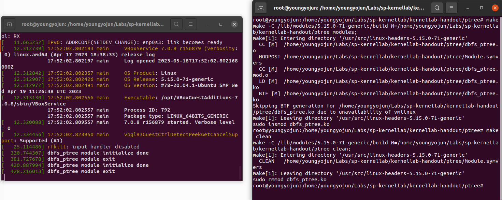
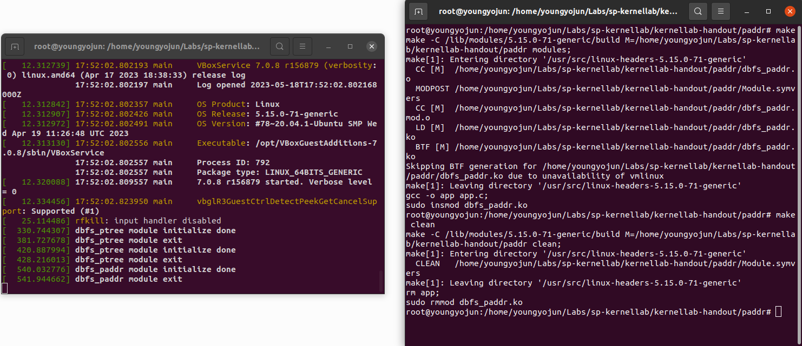

# Lab Assignment 4: Kernel Lab


**공과대학 컴퓨터공학부**
**2020-14378**
**윤교준 / Gyojun Youn**
**youngyojun@snu.ac.kr**


## 구현

### ptree

`input` 파일에 `echo` 등으로 write event가 일어나면 (즉, device에 write system call에 대한 데이터가 들어오면) 그 쓰고자 하는 데이터로부터 입력의 process id를 읽어들인 후, process tree를 통해 모든 조상 processes를 차례대로 출력해야 한다.

#### Module init

`module_init(dbfs_module_init);`을 통해 `ptree` module를 load할 때 `static int __init dbfs_module_init(void)` 함수가 실행된다.

Process id를 입력받기 위한 파일 `input`과, 조상 processes의 결과를 보여주는 파일 `ptree`를 생성해야 한다. 먼저, 이 두 파일이 있을 directory `ptree`를 생성하자.

```c
static int __init dbfs_module_init(void)
{
        // 전략

        /* Create 'ptree' debug directory. */
        dir = debugfs_create_dir("ptree", NULL);
        if (!dir) {
                printk("Cannot create ptree dir\n");
                return -1;
        }

        // 후략
}
```


다음으로, `ptree` directory `dir` 아래에 입력용 파일 `input`을 생성해야 한다. 모두가 쓸 수 있고 대신 읽거나 실행할 수는 없도록 `0222` 권한을 부여했다. 사실 read 권한도 부여했었는데, `cat input` 이나 `vim input`으로 이 파일을 정상적으로 읽을 수 없어서, read 권한을 빼버렸다. 추후 설명할 `write_pid_to_input` 함수가 실제로 파일에 어떤 데이터를 적지 않아서라고 생각한다.

```c
/* Create 'input' debug file for input; only writable */
input_dir = debugfs_create_file("input", 0222, dir, NULL, &dbfs_fops);
if (!input_dir) {
        printk("Cannot create input file\n");
        return -1;
}
```

여기서 `input` 파일에 부여한 operations `dbfs_fops`는 다음과 같다. 이 파일에 쓰기가 이루어지면, `write_pid_to_input` 함수가 호출된다.

```c
static const struct file_operations dbfs_fops = {
        .write = write_pid_to_input,
};
```


이제, output을 위한 파일 `ptree`를 생성해야 한다. 이에 대하여 굉장히 고민이 많았다.

`input`과 같이 `debugfs_create_file`로 생성하여 일반적인 파일을 만들면, 매번 파일의 내용을 모두 지우고, 새로운 문자열을 적어야 한다. 그러나, kernel에서 기본적으로 제공하는 `fprintf`와 같은 좋은 wrapper 함수를 찾을 수 없었고, short count와 씨름하고 싶지 않았다. 파일의 내용을 안전하게 지우는 방법에 대한 확신이 없었고, 매번 파일을 지우고 새로 만드는 것은 올바른 커널 프로그래머의 자세가 아니다. 고로, 나의 지식 안에서 사용법에 대한 충분한 확신이 서는, 임의의 자료형을 담을 수 있는 binary blob을 채택했다.

먼저, binary blob을 생성하기 위해서는 자료의 byte 크기에 대한 추가 정보를 담고 있는 `debugfs_blob_wrapper` 구조체가 필요하다.

```c
/*
 * Blob for output 'ptree'
 *
 * Contain PAGE_SIZE characters as data.
 */
static struct debugfs_blob_wrapper *ptree_blob;

static int __init dbfs_module_init(void)
{
        // 전략
        
        /* Allocate a blob structure. */
        ptree_blob = kmalloc(sizeof(*ptree_blob), GFP_KERNEL);
        if (!ptree_blob) {
                printk("kmalloc error\n");
                return -1;
        }
        
        // 후략
}
```


`ptree`에는 충분히 큰 상수 크기의 문자열을 담을 것이다. Kernel space에서는 `PAGE_SIZE`의 상수 배만큼만 allocation이 가능하기 때문에, 문자열의 길이는 `PAGE_SIZE`로 설정하였다.

```c
/*
 * Data and size of a blob for output.
 */
void *data = NULL;
const long size = PAGE_SIZE * sizeof(char);

/* Allocate data area. */
data = kmalloc(size, GFP_KERNEL);
if (!data) {
        printk("kmalloc error\n");

        kfree(ptree_blob);
        ptree_blob = NULL;

        return -1;
}

/* Set data and size of a blob. */
ptree_blob->data = data;
ptree_blob->size = size;
```


이제, `ptree_blob`을 통해 `dir` directory 아래에 read-only binary blob `ptree`을 생성하자. 이제, `dbfs_module_init` 함수의 역할은 끝났다.

```c
static int __init dbfs_module_init(void)
{
        // 전략

        /* Create 'ptree' blob for output; read-only. */
        ptree_dir = debugfs_create_blob("ptree", 0444, dir, ptree_blob);
        if (!ptree_dir) {
                printk("Cannot create blob for output\n");

                kfree(data);
                data = NULL;

                kfree(ptree_blob);
                ptree_blob = NULL;

                return -1;
        }

        printk("dbfs_ptree module initialize done\n");

        return 0;
}
```


#### write_pid_to_input

조상 processes를 root부터 차례대로 출력해야 하지만, process tree에서는 자식부터 root 방향으로 track할 수 있다. 즉, 방문 순서의 역순으로 출력해야 하므로, 방문 순서를 관리할 linked list를 만들어야 한다. 양방향 linked list의 기계적인 구현은 `list_head` 구조체로 대신할 수 있다.

```c
/*
 * Process linked list structure.
 *
 * The data of the head is nullptr.
 * Next process is a child process.
 * Prev process is a parent process.
 */
struct ptree_node {
        struct task_struct *data;
        struct list_head list;
};
```


먼저, pointers에 대한 간단한 검사를 수행한 후, user space의 buffer를 kernel space buffer로 복사한다. 이 검사는 수행하지 않아도 되지만, 시스템 프로그래밍의 꽃은 철저한 error handling이라고 생각한다.

```c
static ssize_t write_pid_to_input(struct file *fp,
                                  const char __user *user_buffer,
                                  size_t length,
                                  loff_t *position)
{
        // 전략

        char *buffer = NULL;   /* Kernel space buffer */

        int ok = 1;

        /*
        * Check given pointers are valid.
        */

        if (!user_buffer) {
                printk("Invalid user buffer\n");
                return -1;
        }

        if (!ptree_blob || !ptree_blob->data) {
                printk("Output blob is null\n");
                return -1;
        }

        /*
        * Copy user_buffer to kernel space buffer.
        */

        if (ok && !(buffer = kmalloc(length, GFP_KERNEL))) {
                printk("kmalloc error\n");
                ok = 0;
        }

        if (ok && copy_from_user(buffer, user_buffer, length)) {
                printk("Cannot copy from user buffer\n");
                ok = 0;
        }

        // 후략
}
```


이제, kernel space의 `buffer`를 통해 입력된 process id를 읽어온다.

```c
pid_t input_pid;   /* Given pid as input */

/* Read pid in buffer. */
if (ok && 1 != sscanf(buffer, "%u", &input_pid)) {
        printk("Cannot read pid\n");
        ok = 0;
}

kfree(buffer);
buffer = NULL;

if (!ok)
        return -1;
```


이제, `input_pid`의 process id를 가진 process의 `task_struct`를 찾아야 한다. 이는 `pid_task` 함수를 이용하면 쉽게 수행할 수 있다.

```c
struct task_struct *curr = NULL;   /* Current process to track */

/* Get process task of input_pid. */
if (ok && !(curr = pid_task(find_vpid(input_pid), PIDTYPE_PID))) {
        printk("Cannot get process table\n");
        ok = 0;
}
```


Process task `curr`을 통해 부모 방향으로 process tree을 track하기 전에, 방문 순서를 관리할 linked list를 전처리해주어야 한다.

```c
/* Head of process linked list */
struct ptree_node root = {
        .data = NULL,
        .list = LIST_HEAD_INIT(root.list),
};
```


방문하는 순서대로 `root` 다음에 삽입하면, `root`에서 정방향으로 순회한 결과가 방문 역순이 된다. PID 1의 `init` 혹은 `systemd`가 모든 processes의 조상이라고 배웠던 것 같은데, 실제로 확인해보면 thread의 root process는 PID 2의 `kthreadd`이다. `curr`가 `nullptr`가 아니고, PID가 양수이며, self loop가 아닌지 모두 확인함으로써, 가장 안전한 방법으로 process tree의 root 처리를 하였다.

```c
/* Trace process tree and make a linked list. */
while (ok && curr && 0 < curr->pid) {
        /* Allocate a node to store. */
        struct ptree_node *node = kmalloc(sizeof(*node), GFP_KERNEL);
        if (!node) {
                printk("kmalloc error\n");
                ok = 0;
                break;
        }

        /* Store the current task pointer. */
        node->data = curr;

        /* Insert the node right after the head. */
        list_add(&node->list, &root.list);

        /* Escape a self loop. */
        if (curr == curr->real_parent)
                break;

        /* Move to its parent process. */
        curr = curr->real_parent;
}
```


이제, 방문한 각 process에 대하여 `command (pid)`의 형식으로 문자열을 만들어서 이어 붙여야 한다. `snprintf` 함수를 이용하여, 한 줄씩 문자열에 기록할 것이다. 기록을 시작해야 하는 위치 `ptr`과, binary blob의 `data` 배열이 허용하는 끝 주소 `end`를 관리하자.

```c
char *ptr = NULL;   /* Current position to write */

/*
 * End position of the blob data.
 *	== data + size / sizeof(char)
 *
 * Written ptr must be in [ptree_blob->data, end).
 */
char *end = NULL;

// 중략

ptr = ptree_blob->data;
end = ptr + ptree_blob->size / sizeof(char);
```


Linked list의 순회는 `list_for_each_entry` macro를 이용하면 편리하다. `snprintf`가 `[end, +inf)`의 영역을 침범하지 않도록 세심하게 처리해야 한다. `list_for_each_entry`는 `root`를 제외하고 순회하는 것인지, 몇몇의 조건문은 useless했는데 이해할 수 없었다. 아마도, `root`는 linked list의 시작을 의미하는 dummy node와 같은 역할인 듯 하다.

```c
/*
* Trace the linked list to write output.
*/

struct ptree_node *node;
struct task_struct *data;

list_for_each_entry(node, &root.list, list) {
        /* Should not be happened, but I am not sure. */
        if (!node)
                continue;

        data = node->data;

        /* Why it is not happend? */
        if (!data)
                continue;

        /* Write output in a form of "process_command (process_id)". */
        ptr += snprintf(ptr, end - ptr, "%s (%d)\n", data->comm, data->pid);

        /* Lack of space, just break. */
        if (end <= ptr)
                break;
}
```


더이상 linked list는 필요하지 않으므로, `kfree`한다. Linked list를 정리해주는 함수나 macro가 있을 법 한데, `linux/list.h` 코드를 열심히 읽어봐도 찾을 수 없었다.

```c
/* Free every node in the linked list. */
while (!list_is_singular(&root.list)) {
        /* Get the very first node. */
        node = list_entry(root.list.next, struct ptree_node, list);

        /* Remove it from the linked list. */
        list_del(&node->list);

        /* Free the node. */
        kfree(node);
        node = NULL;
}
```


출력 내용이 너무 길었는지 확인하고 에러문을 출력한다.

```c
/* Check the output was trimmed. */
if (end <= ptr && *(end - 1)) {
        printk("Too large output\n");
        ok = 0;
}
```


마지막으로, 사용하지 않은 `[ptr, end)` 영역을 모두 0으로 초기화해야 한다. Binary blob은 단순한 `size` bytes의 data 덩어리기 때문에, 뒷부분을 초기화하지 않으면 `cat ptree` 수행시 첫 `\0` 이후의 문자도 출력된다. 아래의 처리는 예외 상황이 발생해도 수행해야 함에 유의한다.

```c
static ssize_t write_pid_to_input(...)
{
        // 전략

        /*
        * Clean unused space.
        */

        while (ptr < end) {
                *ptr = '\0';
                ptr++;
        }

        *(end - 1) = '\0';

        return ok ? length : -1;
}
```


#### Module exit

`module_exit(dbfs_module_exit);`는 `ptree` module이 unload될 때 `static void __exit dbfs_module_exit(void)` 함수가 실행되도록 한다.

생성했던 파일 `input`, `ptree`를 제거하고, directory `dir`을 제거해야 한다. 이는 `debugfs_remove_recursive(dir);`로 전부 처리할 수 있다.

```c
static void __exit dbfs_module_exit(void)
{
        debugfs_remove_recursive(dir);

        if (ptree_blob) {
                kfree(ptree_blob->data);
                ptree_blob->data = NULL;
        }

        kfree(ptree_blob);
        ptree_blob = NULL;

        printk("dbfs_ptree module exit\n");
}
```


### paddr

Process ID와 그 process의 virtual address가 `packet` 구조체의 형태로 `output` 파일에 기록되어 있을 때, `packet` 구조체의 `paddr`를 read할 때 대응되는 physical address를 user 단에서 얻어올 수 있도록 해야 한다.

#### Module init

`paddr` directory를 생성한 후, 그 아래에 `output` file을 만들어야 한다. `output`은 read event가 발생하면 `read_output` 함수를 실행하도록 file operations을 부여해야 한다.

```c
static const struct file_operations dbfs_fops = {
        .read = read_output,
};

static int __init dbfs_module_init(void)
{
        /* Create 'paddr' debug directory. */
        dir = debugfs_create_dir("paddr", NULL);
        if (!dir) {
                printk("Cannot create paddr dir\n");
                return -1;
        }

        /* Create 'output' debug file for output; readable + writable */
        output = debugfs_create_file("output", 0666, dir, NULL, &dbfs_fops);
        if (!output) {
                printk("Cannot create 'output' file\n");
                return -1;
        }

        printk("dbfs_paddr module initialize done\n");

        return 0;
}
```


#### read_output

먼저, user space buffer를 kernel space로 복사하기 전에, 인자에 대한 가벼운 검사를 수행한다.

```c
static ssize_t read_output(struct file *fp,
                           char __user *user_buffer,
                           size_t length,
                           loff_t *position)
{
        // 전략

        /* Check given pointer is valid. */
        if (!user_buffer) {
                printk("Invalid user buffer\n");
                return -1;
        }

        // 후략
}
```


`packet` 구조체의 `buffer`로 복사한 후, 주어진 `pid`와 `vaddr` 값을 읽어온다.

```c
struct packet *buffer = NULL; /* Kernel space buffer */

pid_t pid;                    /* Given process id */
unsigned long vaddr;          /* Given virtual address */
unsigned long paddr;          /* Corresponding physical address to compute */

int ok = 1;

/*
* Copy user_buffer to kernel space buffer.
*/

buffer = kmalloc(sizeof(*buffer), GFP_KERNEL);
if (!buffer) {
        printk("kmalloc error\n");
        return -1;
}

if (ok && copy_from_user(buffer, user_buffer, sizeof(*buffer))) {
        printk("Cannot read user buffer\n");
        ok = 0;
}

/* Get given pid and virtual address. */
if (ok) {
        pid = buffer->pid;
        vaddr = buffer->vaddr;
}
```


주어진 `pid`의 process `task_struct`를 찾는다.

```c
struct task_struct *task = NULL;   /* Process task */

/* Get process task of pid. */
if (ok && !(task = pid_task(find_vpid(pid), PIDTYPE_PID))) {
        printk("Cannot get process table\n");
        ok = 0;
}
```


지금 사용하는 kernel은 5 level page table의 `PGD -> P4D -> PUD -> PMD -> PTE` 구조를 채택하였다. 이 순서에 맞추어 page table을 차례대로 따라간다. 정의된 macro를 활용할 수 있다.

```c
/*
* 5-level page table.
*
* PGD -> P4D -> PUD -> PMD -> PTE
*/

pgd_t *pgd = NULL;	/* Page global directory    */
p4d_t *p4d = NULL;	/* Page 4th-level directory */
pud_t *pud = NULL;	/* Page upper directory     */
pmd_t *pmd = NULL;  /* Page middle directory    */
pte_t *pte = NULL;  /* Page table entry         */

/* Get PGD from task mm. */
if (ok) {
        pgd = pgd_offset(task->mm, vaddr);
        if (!pgd || pgd_none(*pgd) || pgd_bad(*pgd)) {
                printk("No page global directory\n");
                ok = 0;
        }
}

/* PGD -> P4D */
if (ok) {
        p4d = p4d_offset(pgd, vaddr);
        if (!p4d || p4d_none(*p4d) || p4d_bad(*p4d)) {
                printk("No page 4th-level directory\n");
                ok = 0;
        }
}

/* P4D -> PUD */
if (ok) {
        pud = pud_offset(p4d, vaddr);
        if (!pud || pud_none(*pud) || pud_bad(*pud)) {
                printk("No page upper directory\n");
                ok = 0;
        }
}

/* PUD -> PMD */
if (ok) {
        pmd = pmd_offset(pud, vaddr);
        if (!pmd || pmd_none(*pmd) || pmd_bad(*pmd)) {
                printk("No page middle directory\n");
                ok = 0;
        }
}

/* PMD -> PTE */
if (ok) {
        pte = pte_offset_kernel(pmd, vaddr);
        if (!pte || pte_none(*pte)) {
                printk("No page table entry\n");
                ok = 0;
        }
}
```


최후로, page table entry을 통해 page number를 가져온다. Physical page offset은 virtual address의 하위 비트를 통해 얻을 수 있다. 이 둘을 결합하면, 온전한 physical address를 얻는다.

```c
unsigned long ppn;  /* Physical page number */
unsigned long ppo;  /* Physical page offset */

unsigned long paddr;	/* Corresponding physical address to compute */

/* Compute physical address. */
if (ok) {
        /* Get page number from PTE. */
        ppn = pte_pfn(*pte);

        /* Get offset directly from virtual address. */
        ppo = vaddr & ~PAGE_MASK;

        /* Compute physical address by combining them. */
        paddr = (ppn << PAGE_SHIFT) | ppo;

        /* Write it down. */
        buffer->paddr = paddr;
}
```


`paddr` 값을 적은 kernel space buffer를 다시 user space로 복사하면, `read_output` 함수의 역할은 끝난다.

```c
static ssize_t read_output(...)
{
        // 전략

        /* Copy kernel space buffer to user_buffer. */
        if (ok && copy_to_user(user_buffer, buffer, sizeof(*buffer))) {
                printk("Cannot write user buffer\n");
                ok = 0;
        }

        kfree(buffer);
        buffer = NULL;

        return ok ? length : -1;
}
```


#### Module exit

생성한 `output` 파일과 directory `dir`을 제거하면 충분하다.

```c
static void __exit dbfs_module_exit(void)
{
        debugfs_remove_recursive(dir);

        printk("dbfs_paddr module exit\n");
}
```


## 실행 결과

### Preparation

`lsb_release -a` 및 `uname -ar`의 결과는 다음과 같다.


```
"lsb_release -a"
No LSB modules are available.
Distributor ID:	Ubuntu
Description:	Ubuntu 20.04.6 LTS
Release:	20.04
Codename:	focal

"uname -ar"
Linux youngyojun 5.15.0-71-generic #78~20.04.1-Ubuntu SMP Wed Apr 19 11:26:48 UTC 2023 x86_64 x86_64 x86_64 GNU/Linux
```


### ptree dmesg -w

`ptree`에서 `make`와 `make clean`의 실행 결과다. `make`을 수행하면 `[  420.887994] dbfs_ptree module initialize done`가, `make clean`을 실행하면 `[  428.216013] dbfs_ptree module exit`가 출력된다.



```
[   12.320088] 17:52:02.809557 main     7.0.8 r156879 started. Verbose level = 0
[   12.334456] 17:52:02.823950 main     vbglR3GuestCtrlDetectPeekGetCancelSupport: Supported (#1)
[   25.114486] rfkill: input handler disabled
[  330.744307] dbfs_ptree module initialize done
[  381.727678] dbfs_ptree module exit
[  420.887994] dbfs_ptree module initialize done
[  428.216013] dbfs_ptree module exit
```


### paddr dmesg -w

`paddr`에서 `make`와 `make clean`을 실행한 결과다.



```
[   12.320088] 17:52:02.809557 main     7.0.8 r156879 started. Verbose level = 0
[   12.334456] 17:52:02.823950 main     vbglR3GuestCtrlDetectPeekGetCancelSupport: Supported (#1)
[   25.114486] rfkill: input handler disabled
[  330.744307] dbfs_ptree module initialize done
[  381.727678] dbfs_ptree module exit
[  420.887994] dbfs_ptree module initialize done
[  428.216013] dbfs_ptree module exit
[  540.032776] dbfs_paddr module initialize done
[  541.944662] dbfs_paddr module exit
```


### ptree test

`pstree`를 통해 process tree를 확인하자.

```
root@youngyojun:/home/youngyojun# pstree
systemd─┬─ModemManager───2*[{ModemManager}]
        ├─NetworkManager───2*[{NetworkManager}]
        ├─3*[VBoxClient───VBoxClient───3*[{VBoxClient}]]
        ├─VBoxClient───VBoxClient───4*[{VBoxClient}]
        ├─VBoxDRMClient───4*[{VBoxDRMClient}]
        ├─VBoxService───8*[{VBoxService}]
        ├─accounts-daemon───2*[{accounts-daemon}]
        ├─acpid
        ├─avahi-daemon───avahi-daemon
        ├─colord───2*[{colord}]
        ├─cron
        ├─cups-browsed───2*[{cups-browsed}]
        ├─cupsd───dbus
        ├─dbus-daemon
        ├─gdm3─┬─gdm-session-wor─┬─gdm-x-session─┬─Xorg───{Xorg}
        │      │                 │               ├─***gnome-session-b***─┬─ssh-agent
        │      │                 │               │                       └─2*[{gnome-session-b}]
        │      │                 │               └─2*[{gdm-x-session}]
        │      │                 └─2*[{gdm-session-wor}]
        │      └─2*[{gdm3}]
        ├─gnome-keyring-d─┬─ssh-agent
        │                 └─3*[{gnome-keyring-d}]
        ├─2*[kerneloops]
```


여기서 `***`로 강조해놓은 `gnome-session-b` process를 테스트해보자. `ps aux`를 통해 PID를 확인할 수 있다.

```
root@youngyojun:/home/youngyojun# ps aux | grep gnome-session-b
youngyo+     976  0.0  0.1 200532 15400 tty2     Sl+  17:09   0:00 /usr/libexec/gnome-session-binary --systemd --systemd --session=ubuntu
youngyo+    1126  0.0  0.2 496468 17588 ?        Ssl  17:09   0:00 /usr/libexec/gnome-session-binary --systemd-service --session=ubuntu
root        5568  0.0  0.0   3180   648 pts/1    R+   21:42   0:00 grep --color=auto gnome-session-b
root@youngyojun:/home/youngyojun# 
```


`976`의 pid를 입력으로 하여, `ptree`를 테스트해보자. 

```
root@youngyojun:/sys/kernel/debug/ptree# echo 976 >> input 
root@youngyojun:/sys/kernel/debug/ptree# cat ptree 
systemd (1)
gdm3 (809)
gdm-session-wor (825)
gdm-x-session (859)
gnome-session-b (976)
root@youngyojun:/sys/kernel/debug/ptree#
```

위에서 확인한 process tree와 결과가 일치함을 확인할 수 있다.


## 어려웠던 점

첫 lab에서 안내받은 특정 kernel version을 사용하고 싶었지만, 아주 많은 방법을 시도했음에도 불구하고 성공하지 못하였다. Kernel을 직접 git에서 받아 컴파일하면 컴퓨터가 켜지지 않았다. 결국, `Ubuntu 20.04.6 LTS`의 기본 kernel을 사용하였다.

Kernel쪽 코드는 접할 일이 별로 없었기 때문에 구현을 시작하기까지 많은 시간이 필요했다. 또한, 작은 구현 실수가 OS를 멈추어버리기 때문에 매우 작은 구현량에 비해 상당한 시간이 들었다.

함수에 대한 자료는 https://docs.kernel.org/ 와 https://archive.kernel.org/ , https://elixir.bootlin.com/ 을 주로 참고하였다. 입문 장벽이 생각보다 높고, 나의 고민을 해결해주는 자료를 이 사이트나 인터넷에서 찾기 힘들었다. 그러나, 개념에 익숙해지니 reference site만큼 신뢰도가 높은 참고 자료가 없었다.

`linux/list.h`의 `list_head` 구조체와 관련된 함수와 macro는 설명이 자세하게 되어 있지 않아서, 직접 코드를 읽었다. 특히 `container_of` marco는 작동 기작을 깨우치기 상당히 까다로웠다. 구조체 내부에서 각 member 간의 상대적 위치 차이는 compiler time에 결정되기 때문에 가능한 trick이라고 생각한다.

```c
#define container_of(ptr, type, member) ({				\
        void *__mptr = (void *)(ptr);					\
        ((type *)(__mptr - offsetof(type, member))); })
```

`ptree`에서 output 파일 `ptree`을 `debugfs_create_file`로 생성한 다음, 내용을 초기화하고 문자열을 추가하는 과정을 구현하는데 많은 노력이 들어갔고, 결과물이 만족스럽지 못하였다. Binary blob을 시도하기까지 많은 시도가 있었다.

`paddr`에서는 5 level page table 자료에 접근하기 힘들었다.

Error handling 과정에서 코딩 스타일에 대한 많은 고민이 있었다. 여러 개의 error cases가 동일한 후처리 작업을 필요로 할 때, 코드의 반복이 없고, `goto` 구문을 사용하지 않는 명료한 방법을 찾고자 노력했다. `int ok` 변수의 활용이 나의 최선의 결과물이다.


## 새롭게 배운 점

Kernel module에 대한 가이드는 https://tldp.org/LDP/lkmpg/2.6/html/ 에서, kernel coding에 대한 가이드라인 문서는 https://www.kernel.org/doc/html/v4.10/admin-guide/index.html 을 참고하였다.

Kernel code의 style을 알기 위해 `kernel/fork.c`, `kernel/user.c`, `kernel/module/main.c` 등의 소스 코드를 가볍게 읽었다. 하나의 탭은 8 spaces로 두었고, 실제 코딩 작업도 비슷한 환경에서 하려고 노력했다. 이 보고서에는 모든 tab character가 8 spaces로 대체되어, 코드와 동일한 indenting으로 읽히도록 하였다.

Multi-level page table의 실제 구현과 이를 이용하여 virtual address를 physical address로 mapping하는 과정을 처음으로 구현해보았다.

PID 1의 process인 `init`와 `systemd` 는 단순하게 이름만 다른 것이 아니었다. `systemd`는 구 linux의 `init`에서 시스템 관리 demon의 역할이 더 부여되었다. 미묘한 차이가 많았지만, 지식을 모두 이해하기에는 어려웠다.
